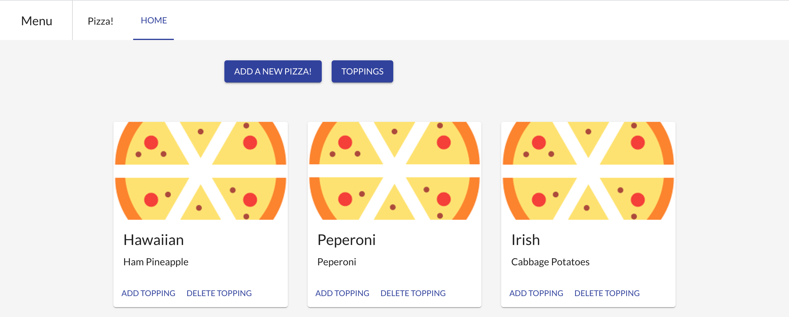
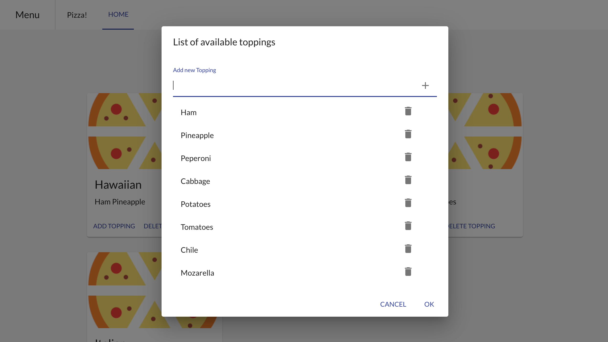

# Pizza-Menu
Application that manages a Pizza Menu using NodeJS, React and Redux.

##Getting started 
### Install dependencies 
#### Backend 
Get into the backend directory
```bash
cd backend
```

Install all necessary dependencies for the server
```bash
npm install
```
There is a script that creates and populates the database given that the user has a MySQL instance running. 
Just update the "cleanData" task with the corresponding username and password of mysql
```bash
mysql -u<username> -p<password>
```
```bash
npm run cleanData
```
Refer to the following directory to see the scripts to create and populate the database. Remember to have the MySQL instance running (Docker image comming soon)
```bash
./backend/database
```

Finally, add the username and password to the configuration file. Edit the username and password of the mysql instance
```bash
./backend/config/env/development.js
```

#### Frontend 
Get into the frontend directory
```bash
cd frontend
```
Install all necessary dependencies for the UI
```bash
npm install
```

##Run
### Backend 
Just get into the backend directory and run
```bash
npm start
```

You can verify all the endpoints using this link:
http://localhost:3001/ <br />
The password to authenticate the user and to be able to use the swagger is: 'root'


#### Test 
To run all the tests in the backend just run:
 ```bash
 npm test
 ```
### Frontend 
In another terminal go to the frontend directory and run

```bash
npm start
```

Go to http://localhost:3000/ to see the app running
You can see your favorite pizzas

Or add a new one

Don't forget to add new toppings or delete the ones you don't want anymore 

#### Production build 
To generate a build ready for production just run:
 ```bash
 npm run build
 ```

## Author
[Niklaus Geisser](https://github.com/nik1168)
