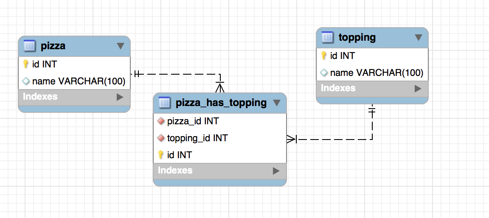

# Technologies Used
In this section, the technologies used for implementing the pizza-menu application will be described.

## Persistence Layer
A relational model is enough to satisfy all the requirements given for the application. The following image describes the relationship between each entity.

Regarding the Relational Database Management System, MySQL was used. However, since an ORM was used, another RDBMS can be easily implemented

## Backend
 - The API was implemented using **NodeJS** and **Express** as it allows the creation of web services in a flexible, simple and scalable way. Moreover, it is quite easy to set up a development environment. It can handle multiple requests since all the I/O operations are processed in thread pools. 
 - As it was mentioned before, an ORM was implemented ([Sequelize](https://sequelize.org/)) in order to use other RDBMS. 
 - Endpoints are protected through an API key although the initial logic for using json web tokens has been implemented.
 - [Swagger](https://swagger.io/) was used to document the endpoints. 
 
 ## Frontend
  - ReactJs was used to develop the UI as it makes it user to implement and re-use web components. It has a good performance regarding rendering.
  - Redux was used to manage the sate.
  - An interceptor was created for future requirements regarding to session management and user roles.  
